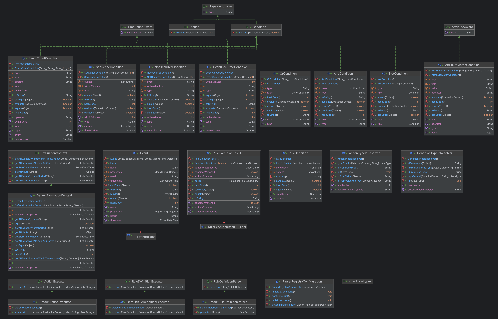

# Rulex

Rulex is a modular, extensible rule engine built with Java 21 and Spring Boot 3.4.0. It allows you to define, evaluate, and execute business rules dynamically using a flexible API and a robust core engine.

---

## Table of Contents
- [Architecture Overview](#architecture-overview)
- [Key Interfaces](#key-interfaces)
- [Design Patterns](#design-patterns)
- [Modules](#modules)
- [How to Run](#how-to-run)
- [API Usage](#api-usage)
- [Extending Rulex](#extending-rulex)
- [Contributing](#contributing)

---

## Architecture Overview

Rulex is organized into three main Maven modules:

- **rulex-core**: Contains the core engine, domain models, interfaces, and rule parsing logic.
- **rulex-api**: Exposes RESTful endpoints for rule evaluation and management.
- **rulex-starter**: The Spring Boot application entry point for running the service.

---

## UML Diagram



---

## Key Interfaces

Below is a table explaining the purpose and role of each interface in the `rulex-core` module, along with example snippets and typical implementors:

| Interface Name             | Description & Responsibility                                                                | Main Method(s) / Signature(s)                                  | Example Implementation / Usage                                                                                 |
|----------------------------|---------------------------------------------------------------------------------------------|----------------------------------------------------------------|---------------------------------------------------------------------------------------------------------------|
| **TypeIdentifiable**       | Provides a way for objects to expose their type as a string, useful for polymorphic serialization and type resolution. | `String getType()`                                             | All `Action` and `Condition` implementations (e.g., `SendEmailAction`, `AttributeMatchCondition`)             |
| **AttributeAware**         | For classes that operate on a specific attribute/field, such as conditions that match on user attributes. | `String getField()`                                            | `AttributeMatchCondition` (matches a user attribute against a value)                                          |
| **TimeBoundAware**         | For classes that need to operate within a time window, such as time-based conditions.       | `Duration getTimeWindow()`                                     | `EventCountCondition`, `EventOccurredCondition`, `NotOccurredCondition`, `SequenceCondition`                  |
| **ConditionTypes**         | Holds string constants for various condition types, ensuring type safety and consistency.   | (Constants only)                                               | Used in all condition implementations to set the `type` field (e.g., `ConditionTypes.ATTRIBUTE_MATCH`)        |
| **Condition**              | Core interface for all rule conditions. Evaluates a condition against an `EvaluationContext`. Extends `TypeIdentifiable`. | `boolean evaluate(EvaluationContext context)`                  | `AttributeMatchCondition`, `EventCountCondition`, `AndCondition`, `OrCondition`, `NotCondition`, etc.         |
| **Action**                 | Core interface for all actions to be executed when a rule matches. Extends `TypeIdentifiable`. | `void execute(EvaluationContext context)`                      | `SendEmailAction`, `ApplyBonusAction`, `UpdateUserAction`                                                     |
| **EvaluationContext**      | Provides access to events and attributes for rule evaluation. Methods for querying events and attributes in various ways. | `Object getAttribute(String field)`<br>`List<Event> getAllEventsByName(String name)`<br>...         | `DefaultEvaluationContext`                                                                                    |
| **RuleDefinitionExecutor** | Declares the contract for executing a rule definition and returning the result.             | `RuleExecutionResult execute(RuleDefinition, EvaluationContext)`| `DefaultRuleDefinitionExecutor`                                                                               |
| **ActionExecutor**         | Executes a list of actions and returns execution results.                                   | `Map<String, List<String>> executeAll(List<Action>, EvaluationContext)` | `DefaultActionExecutor`                                                                                       |
| **RuleDefinitionParser**   | Parses a rule definition from a JSON string.                                                | `RuleDefinition parseRule(String ruleJson)`                    | `DefaultRuleDefinitionParser`                                                                                 |

---

### Example Snippets

#### TypeIdentifiable
```java
public interface TypeIdentifiable {
    String getType();
}
```
*Used by:*
```java
public class SendEmailAction implements Action {
    private String type = "send_email";
    public String getType() { return type; }
    // ...
}
```

#### AttributeAware
```java
public interface AttributeAware {
    String getField();
}
```
*Used by:*
```java
public class AttributeMatchCondition implements Condition, AttributeAware {
    private String field;
    public String getField() { return this.field; }
    // ...
}
```

#### TimeBoundAware
```java
public interface TimeBoundAware {
    Duration getTimeWindow();
}
```
*Used by:*
```java
public class EventCountCondition implements Condition, TimeBoundAware {
    private int withinDays;
    public Duration getTimeWindow() { return Duration.ofDays(this.withinDays); }
    // ...
}
```

#### Condition
```java
public interface Condition extends TypeIdentifiable {
    boolean evaluate(EvaluationContext context);
}
```
*Used by:*
```java
public class AndCondition implements Condition {
    private List<Condition> rules;
    public boolean evaluate(EvaluationContext context) {
        return rules.stream().allMatch(condition -> condition.evaluate(context));
    }
}
```

#### Action
```java
public interface Action extends TypeIdentifiable {
    void execute(EvaluationContext context);
}
```
*Used by:*
```java
public class ApplyBonusAction implements Action {
    public void execute(EvaluationContext context) {
        // Apply bonus logic
    }
}
```

#### EvaluationContext
```java
public interface EvaluationContext {
    Object getAttribute(String field);
    List<Event> getAllEventsByName(String name);
    // ...
}
```
*Used by:*
```java
public class DefaultEvaluationContext implements EvaluationContext {
    // Implements all methods
}
```

#### RuleDefinitionExecutor
```java
public interface RuleDefinitionExecutor {
    RuleExecutionResult execute(RuleDefinition ruleDefinition, EvaluationContext context);
}
```
*Used by:*
```java
public class DefaultRuleDefinitionExecutor implements RuleDefinitionExecutor {
    // Implements execute method
}
```

#### ActionExcutor
```java
public interface ActionExcutor {
    Map<String, List<String>> executeAll(List<Action> actions, EvaluationContext context);
}
```
*Used by:*
```java
public class DefaultActionExecutor implements ActionExcutor {
    // Implements executeAll method
}
```

#### RuleDefinitionParser
```java
public interface RuleDefinitionParser {
    RuleDefinition parseRule(String ruleJson);
}
```
*Used by:*
```java
public class DefaultRuleDefinitionParser implements RuleDefinitionParser {
    // Implements parseRule method
}
```

---

For more details on architecture, design patterns, and how to run the project, see the earlier sections of this README. 